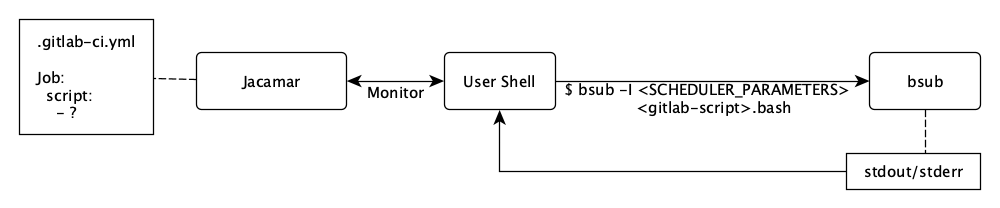
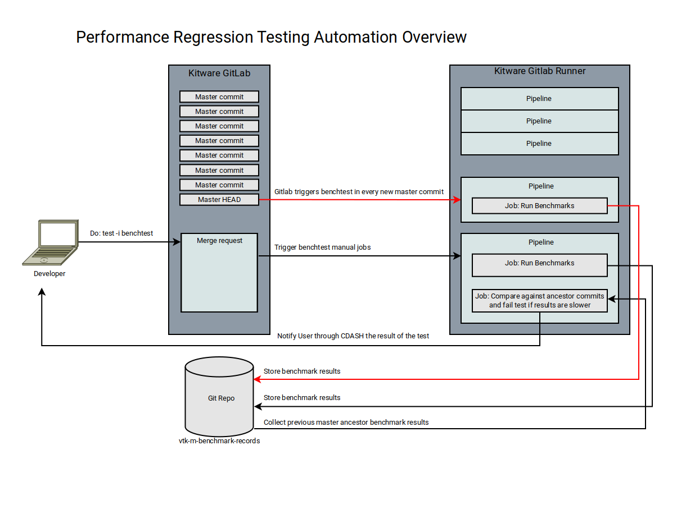

Gitlab CI
===============

# High level view
1. Kitware Gitlab CI
    - Why pipelines
    - Gitlab runner tags

2. How to use docker builders locally
    - Setting up docker
    - Setting up nvidia runtime
    - Running docker images

3. How to Add/Update Kitware Gitlab CI
    - How to add a new builder
    - How to add a new tester
    - How to update an existing docker image

4. ECP Continuous Integration
   - OLCF Ascent testing machine

5. Automated Performance Regression tests
   - Overview
   - Details

# Kitware Gitlab CI

GitLab CI/CD allows for software development through continous integration, delivery, and deployment.
VTK-m uses continuous integration to verify every merge request, by running a pipeline of scripts to build, test,
the code changes across a wide range of hardware and configurations before merging them into master.

This workflow allow everyone to easily catch build failures, bugs, and errors before VTK-m is deployed in a
production enviornment. Making sure VTK-m is a robust library provides not only confidence to our users
but to every VTK-m developer. When the system is working developers can be confident that failures
seen during CI are related to the specific changes they have made.

GitLab CI/CD is configured by a file called `.gitlab-ci.yml` located at the root of the VTK-m repository.
The scripts set in this file are executed by the [GitLab Runners](https://docs.gitlab.com/runner/) associated with VTK-m.

## Why pipelines

Pipelines are the top-level component of continuous integration. For VTK-m the pipeline contains build and test stages, with the possibilty of adding subsequent stages such as coverage, or memory checking.

Decomposing the build and test into separate components comes with some significant benifits for VTK-m developers.
The most impactful change is that we now have the ability to compile VTK-m on dedicated 'compilation' machines and
test on machines with less memory or an older CPU improving turnaround time. Additionally since we are heavily
leveraging docker, VTK-m build stages can be better load balanced across the set of builders as we don't have
a tight coupling between a machine and build configuration.

## Gitlab runner tags

Current gitlab runner tags for VTK-m are:

    - build
        Signifies that this is will be doing compilation
    - test
        Signifies that this is will be running tests
    - vtkm
        Allows us to make sure VTK-m ci is only run on VTK-m allocated hardware
    - docker
        Used to state that the gitlab-runner must support docker based ci
    - linux
        Used to state that we require a linux based gitlab-runner
    - large-memory
        Used to state that this step will require a machine that has lots of memory.
        This is currently used for CUDA `build` requests
    - cuda-rt
        Used to state that the runner is required to have the CUDA runtime environment.
        This is required to `build` and `test` VTK-m when using CUDA 
    - maxwell
    - pascal
    - turing
        Only used on a `test` stage to signify which GPU hardware is required to
        run the VTK-m tests

# How to use docker builders locally

When diagnosing issues from the docker builders it can be useful to iterate locally on a 
solution.

If you haven't set up docker locally we recommend following the official getting started guide:
    - https://docs.docker.com/get-started/


## Setting up nvidia runtime

To properly test VTK-m inside docker containers when the CUDA backend is enabled you will need
to have installed the nvidia-container-runtime ( https://github.com/NVIDIA/nvidia-container-runtime )
and be using a recent version of docker ( we recommend docker-ce )


Once nvidia-container-runtime is installed you will want the default-runtime be `nvidia` so
that `docker run` will automatically support gpus. The easiest way to do so is to add
the following to your `/etc/docker/daemon.json`

```
{
 "default-runtime": "nvidia",
    "runtimes": {
        "nvidia": {
            "path": "/usr/bin/nvidia-container-runtime",
            "runtimeArgs": []
        }
    },
}
```

## Running docker images

To simplify reproducing docker based CI workers locally, VTK-m has python program that handles all the
work automatically for you.

The program is located in `[Utilities/CI/reproduce_ci_env.py ]` and requires python3 and pyyaml. 

To use the program is really easy! The following two commands will create the `build:rhel8` gitlab-ci
worker as a docker image and setup a container just as how gitlab-ci would be before the actual
compilation of VTK-m. Instead of doing the compilation, instead you will be given an interactive shell. 

```
./reproduce_ci_env.py create rhel8
./reproduce_ci_env.py run rhel8
```

To compile VTK-m from the the interactive shell with the settings of the CI job you would do the following:
```
> src]# bash /run-gitlab-stage.sh
```

# How to Add/Update Kitware Gitlab CI

Adding new build or test stages is necessary when a given combination of compiler, platform,
and VTK-m options isn't already captured by existing builders. Each definition is composed via 3 components; tags, variables, and extends.

Tags are used to by gitlab-ci to match a given build to a set of possible execution locations.
Therefore we encode information such as we require docker or the linux kernel into tags.
The full set of VTK-m tags each meaning are found under the `runner tags` section of the document.

Extends is used to compose the execution enviornment of the builder. Basically this means
setting up the correct build/test enviornment and specifying the CMake scripts that need
to be executed. So a linux docker based builder would extend the docker image they want,
plus `.cmake_build_linux`. A MacOS builder would extend `.cmake_build_macos`.

Variables control stage specific information such as runtime enviornment variables,
or VTK-m CMake options.

## How to add a new builder

Each builder definition is placed inside the respective OS `yml` file located in
`.gitlab/ci/`. Therefore if you are adding a builder that will run on Ubuntu 20.04 it
would go into `.gitlab/ci/ubuntu2004.yml`.

Variables are used to control the following components:

    - Compiler
    - VTK-m CMake Options
    - Static / Shared
    - Release / Debug / MinSizeRel

An example defitinon of a builder would look like:
```yml
build:ubuntu2004_$<compiler>:
  tags:
    - build
    - vtkm
    - docker
    - linux
  extends:
    - .ubuntu2004
    - .cmake_build_linux
    - .only-default
  variables:
    CC: "$<c-compiler-command>"
    CXX: "$<cxx-compiler-command>"
    CMAKE_BUILD_TYPE: "Debug|Release|MinSizeRel"
    VTKM_SETTINGS: "tbb+openmp+mpi"
```

If this builder requires a new docker image a coupe of extra steps are required

1. Add the docker image to the proper folder under `.gitlab/ci/docker`. Images
are laid out with the primary folder being the OS and the secondary folder the
primary device adapter it adds. We currently consider `openmp` and `tbb` to
be small enough to be part of any image.

2. Make sure image is part of the `update_all.sh` script, following the convention
of `platform_device`.

3. Update the `.gitlab-ci.yml` comments to list what compiler(s), device adapters,
and other relevant libraries the image has.

4. Verify the image is part of the `.gitlab-ci.yml` file and uses the docker image
pattern, as seen below. This is important as `.docker_image` makes sure we
have consistent paths across all builds to allow us to cache compilation object
files.

```yml
.$<platform>_$<device>: &$<platform>_$<device>
  image: "kitware/vtkm:ci-$<platform>_$<device>-$<YYYYMMDD>"
  extends:
    - .docker_image
```

## How to add a new tester

Each test definition is placed inside the respective OS `yml` file located in
`.gitlab/ci/`. Therefore if you are adding a builder that will run on Ubuntu 20.04 it
would go into `.gitlab/ci/ubuntu2004.yml`.

The primary difference between tests and build definitions are that tests have
the dependencies and needs sections. These are required as by default
gitlab-ci will not run any test stage before ALL the build stages have
completed.

Variables for testers are currently only used for the following things:
    - Allowing OpenMPI to run as root

An example defitinon of a tester would look like:
```yml
test:ubuntu2004_$<compiler>:
  tags:
    - test
    - cuda-rt
    - turing
    - vtkm
    - docker
    - linux
  extends:
    - .ubuntu2004_cuda
    - .cmake_test_linux
    - .only-default
  dependencies:
    - build:ubuntu2004_$<compiler>
  needs:
    - build:ubuntu2004_$<compiler>
```

## How to update an existing docker image

Updating an image to be used for CI infrastructure can be done by anyone that
has permissions to the kitware/vtkm dockerhub project, as that is where
images are stored.

Each modification of the docker image requires a new name so that existing open
merge requests can safely trigger pipelines without inadverntly using the
updated images which might break their build.

Therefore the workflow to update images is
1. Start a new git branch
2. Update the associated `Dockerfile`
3. Locally build the docker image
4. Push the docker image to dockerhub
5. Open a Merge Request


To simplify step 3 and 4 of the process, VTK-m has a script (`update_all.sh`) that automates
these stages. This script is required to be run from the `.gitlab/ci/docker` directory, and
needs to have the date string passed to it. An example of running the script:

```sh
sudo docker login --username=<docker_hub_name>
cd .gitlab/ci/docker
sudo ./update_all.sh 20201230
```

# ECP Continuous Integration

## OLCF Ascent testing machine

VTK-m provides CI builds that run at the OLCF Ascent testing cluster.  OLCF
Ascent is a scaled down version of OLCF Summit which replicates the same
provisions of software and architecture found at OLCF Summit, this is very
useful for us since we are allowed to periodically and automatically branches of
VTK-m. This is a significant leap compared to our previous workflow in which we
would have someone to manually test at OLCF Summit every few months.

The ECP Gitlab continuous integration infrastructure differs from the Kitware
Gitlab CI infrastructure at the following points:

- Kitare Gitlab CI uses the `docker` executer as the _backend_ for its
  `Gitlab-Runner` daemon whereas ECP Gitlab CI uses the Jacamar CI executer as
  the _backend_ for the `Gitlab-Runner` daemon.

- ECP Gitlab VTK-m project is a mirror Gitlab project of the main Kitware Gitlab
  VTK-m repository.

- The runners provided by the ECP Gitlab CI reside inside the OLCF Ascent
  cluster.

Jacamar CI allows us to implicitly launch jobs using the HPC job scheduler LSF.
Jacamar-CI also connects the LSF job with the GitLab project which allows us to
control its state, monitor its output, and access its artifacts. Below is a brief
diagram describing the relations between the GitLab CI instance and the job.



Our Ascent Pipeline is composed of two stages:

1. The build stage, which builds VTK-m and runs in the batch nodes
2. The test stage, which runs VTK-m unit tests and runs at the compute nodes.

Due to the isolated environment in which LFS jobs run at Ascent, we are not able
to access to our `sccache` file server as we do in our other CI builds, thus,
for this very site we provide a local installation of `ccache`. This it turns
out to provided similar hit ratios as `sscache`, since we do not have any other
CI site that runs a _Power9_ architecture.

Lastly, builds and tests status are reported to our VTK-m CDashboard and are
displayed in the same groups as Kitware Gitlab's builds.

As for the flavor being currently tested at ECP Ascent is VTK-m with CUDA and
GCC8.

For a view of only ascent jobs refer to the following [link][cdash-ascent].

# Automated Performance Regression tests

## Overview

The design of the performance regression test is composed of the following
components:

1. The Kitware Gitlab instance which trigger the benchmark jobs when a git
   commit is pushed.
2. Gitlab CI jobs for performing the benchmarks and for generating the
   comparison with the historical results.
3. A Git repository that is used for storing the historical results.
4. The Kitware CDASH instance which files, displays the performance report and
   inform the developer if a performance regression has occurred.

The performance regression test is performed whenever a git commit is pushed.
The job _performancetest_ which invoke the benchmark suite in a Gitlab runner
job and later compare its results against the historical results, stored in
CDASH, of its most immediate master ancestor. The results of this comparison are
then displayed in a brief report in the form of a comment in its corresponding
Gitlab merge-request.



## Details

### Selection of Benchmarks

While we can possibly run all of the provided benchmarks in the continuous
build track to avoid potential performance and latency issues in the CI, I
have initially limited the benchmark suites to:

- BenchmarkFilters
- BenchmarkInsitu

### Benchmark ctest

We provide a CMake function named `add_benchmark_test` which sets the
performance regression test for the given Google Benchmark suite. It admits one
argument to filter the number of benchmarks to be executed. If ran locally, it
will not upload the results to the online record repository. 

### Requirements

- Python3 with the SciPy package
- Benchmark tests will be enabled in a CMAKE build that sets both
  `VTKm_ENABLE_BENCHMARKS` and `VTKm_ENABLE_PERFORMANCE_TESTING`

### New Gitlab Runner requirements

- It must have disabled every type of CPU scaling option both at the BIOS and
  Kernel level (`cpugovern`).
- It must provide a gitlab runner with a concurrency level 1 to avoid other
  jobs being scheduled while the benchmark is being executed.

### How to make sense of the results

Results of both of the benchmark and the comparison against its most recent
commit ancestor can be accessed in the CDASH Notes for the performance
regression build. The CDASH Notes can be accessed by clicking the note-like
miniature image in the build name column.

Performance Regressions test that report a performance failure are reported in
the form of a test failure of the test `PerformanceTest($TestName)Report`. The
results of the comparison can be seen by clicking this failed test.

Performance regression test success is determined by the performance of a null
hypothesis test with the hypothesis that the given tests performs similarly
or better than the baseline test with a confidence level 1-alpha. If a pvalue is
small enough (less than alpha), we reject the null hypothesis and we report that
the current commit introduces a performance regression.  By default we use a
t-distribution with an alpha value of 5%. The pvalues can be seen in the
uploaded reports.

The following parameters can be modified by editing the corresponding
environmental variables:

- Alpha value: `VTKm_PERF_ALPHA`
- Minimum number of repetitions for each benchmark: `VTKm_PERF_REPETITIONS`
- Minimum time to spend for each benchmark: `VTKm_PERF_MIN_TIME`
- Statistical distribution to use: `VTKm_PERF_DIST`

Below is an example of this raw output of the comparison of the current commit
against the baseline results:

```
Benchmark                       Time             CPU      Time Old      Time New       CPU Old       CPU New
------------------------------------------------------------------------------------------------------------
BenchThreshold/manual_time   +0.0043         +0.0036            73            73            92            92
BenchThreshold/manual_time   +0.0074         +0.0060            73            73            91            92
BenchThreshold/manual_time   -0.0003         -0.0007            73            73            92            92
BenchThreshold/manual_time   -0.0019         -0.0018            73            73            92            92
BenchThreshold/manual_time   -0.0021         -0.0017            73            73            92            92
BenchThreshold/manual_time   +0.0001         +0.0006            73            73            92            92
BenchThreshold/manual_time   +0.0033         +0.0031            73            73            92            92
BenchThreshold/manual_time   -0.0071         -0.0057            73            73            92            92
BenchThreshold/manual_time   -0.0050         -0.0041            73            73            92            92
```

[cdash-ascent]: https://open.cdash.org/index.php?project=VTKM&filtercount=1&showfilters=1&field1=site&compare1=63&value1=ascent
